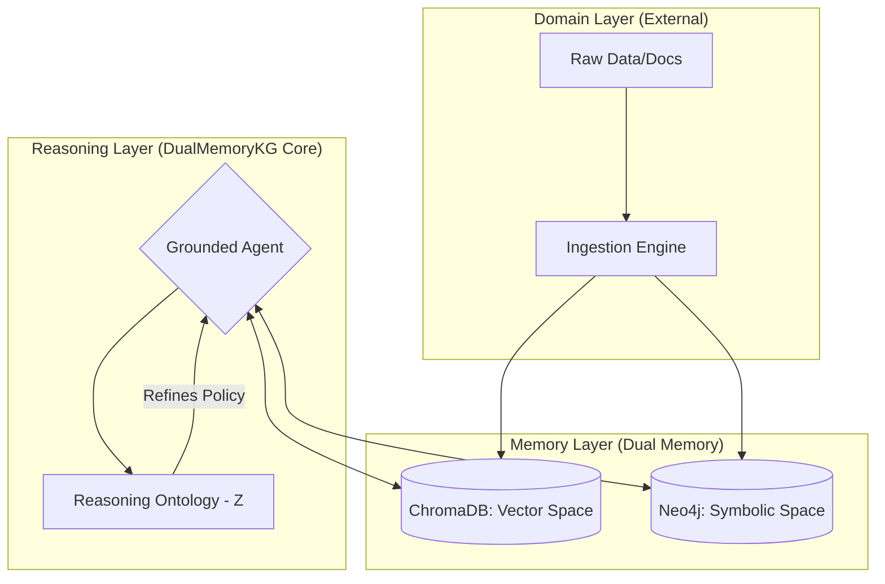
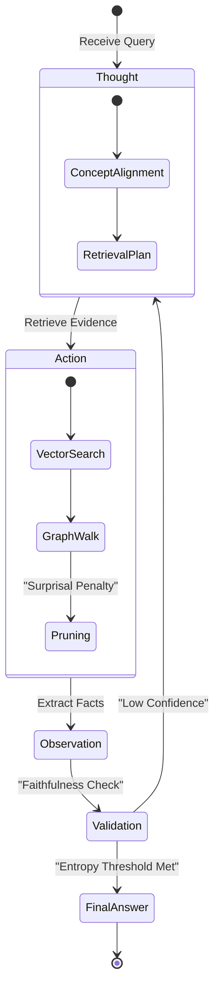
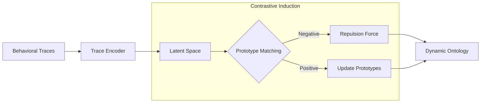
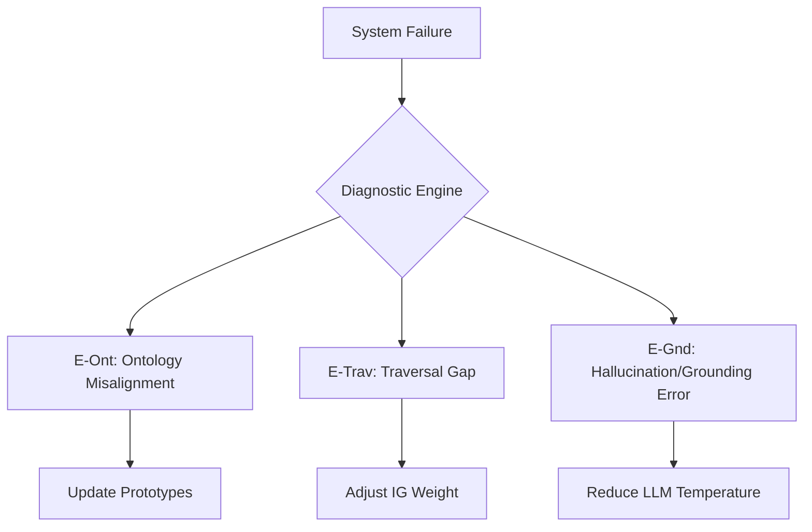
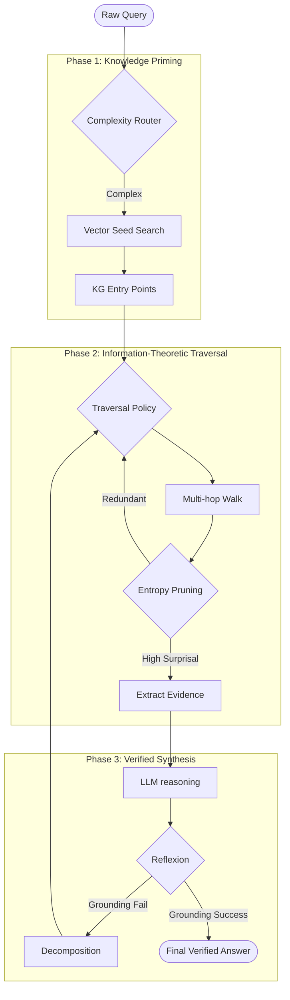
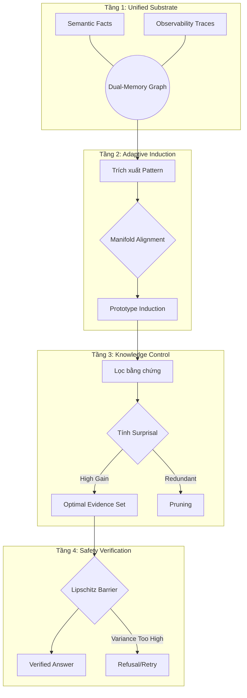

# DualMemoryKG: A Domain-Agnostic Dual-Memory Framework for Grounded Reasoning


**DualMemoryKG** is a research-to-production framework designed to solve the problem of hallucinations in LLMs through explicit, mathematically rigorous evidence control over a Dual-Memory Knowledge Graph (Semantic + Observability memories).

This repository has been upgraded to **Enterprise-Grade** and is specifically targeted for top-tier **Q1 Academic Publication**.

---

## 🌟 Core Breakthroughs (Q1 Contributions)

1. **Contrastive Latent Ontology Induction**: Automatically learns and separates latent reasoning strategies from behavioral traces using a contrastive prototype learning mechanism.
2. **Information-Theoretic Evidence Selection**: Models graph traversal as an uncertainty reduction problem, optimizing for *Marginal Information Gain* (IG) and minimizing Shannon Entropy $H(X)$.
3. **Deep Error Decomposition Framework**: Implements a scientific error taxonomy (`E-Ont`, `E-Trav`, `E-Gnd`) to diagnose exact failure mechanisms.
4. **Synaptic Plasticity & Hebbian Evolution**: The Knowledge Graph dynamically evolves its connection weights based on historical grounded success, implementing a form of *Active Knowledge Refinement*.
5. **Manifold Robustness & Lipschitz Stability**: Ensures that the reasoning policy is invariant to minor query perturbations, providing theoretical guarantees against adversarial hallucinations.
6. **Auto-Adaptive Meta-Tuning**: Automatically optimizes Information Gain and Redundancy parameters using a feedback loop, transitioning from heuristic RAG to *Meta-Learning RAG*.
7. **Epistemic Humility (Uncertainty-Triggered HIL)**: A mathematically rigorous mechanism that detects when internal/external knowledge is insufficient and autonomously requests human grounding.

## 🏗️ Architectural Blueprints

### 1. Macro-Architecture: The Knowledge Bridge
This diagram illustrates the separation between Continuous (Semantic) and Discrete (Symbolic) memory layers, synchronized by the Reasoning Ontology.



### 2. Uncertainty-Aware Reasoning Loop
The ReAct cycle is augmented with an **Information-Theoretic Gate** that controls evidence acquisition based on Surprisal.



### 3. Contrastive Latent Ontology Induction (Feed-forward)
How behavioral traces evolve into stable reasoning prototypes.



### 4. Deep Error Decomposition (RCA Engine)
The scientific diagnostic flow used to prove the **Grounding Objective**.



### 5. End-to-End Grounded Reasoning Pipeline
The full journey from a raw query to a mathematically verified answer.



## 📁 Repository Structure (Product Standard)

```text
DualMemoryKG/
├── core/                   # (Planned) Python package root
├── agents/                 # ReAct & Reflexion implementations
├── common/                 # Pydantic-based configuration & logging
├── diagnostics/            # RCA & Error Decomposition Engine
├── docs/                   # Full academic and technical documentation
├── eval/                   # Grounding-centered metrics and summaries
├── knowledge_graph/        # Neo4j Graph schemas and queries
├── reasoning_ontology/     # Contrastive Latent Ontology Learner
├── traversal_policy/       # Uncertainty-Aware Evidence Selector
├── scripts/                # Entry points for experiments and pipelines
├── pyproject.toml          # Packaging and tooling configuration
└── .env                    # Environment variables (Pydantic validated)
```

## 🚀 Fast-Track Executive Guide (10,000 Queries)

To support a **Q1 publication**, we have implemented a high-reliability experiment pipeline with automated SOTA comparison.

### 1. Pre-flight Check
Ensure your environment is stable and keys are valid.
```bash
python scripts/pre_flight_check.py
```

### 2. Execution (Step-by-Step)
For a full detailed guide, please refer to: [**EXPERIMENT_GUIDE_V2.md**](./EXPERIMENT_GUIDE_V2.md)

Recommended sequence for 10k run:
1.  **Probe (100 rows)**: `python scripts/run_controlled_full.py --strategy heuristic --probe`
2.  **Full Run**: `python scripts/run_controlled_full.py --strategy heuristic`
3.  **Analysis**: `python scripts/run_analysis_pipeline.py`

### 3. Deep Error Decomposition
After running the experiments, perform automated RCA to prove grounding:
```bash
python scripts/run_rca_decomposition.py --rca-json output/your_results.json
```

## 📖 Documentation

All detailed academic and technical documentation has been organized in the `docs/` folder:
- **Theoretical Claims**: `docs/THEORETICAL_CLAIMS_AND_PROOF_SKETCH.md`
- **Error Diagnostics**: `docs/TROUBLESHOOTING_VI.md`
- **Reproduction Guide**: `docs/REPRODUCTION_GUIDE_VI.md`

## 6. Master Synthesis Flow: Toàn cảnh luồng tri thức và điều khiển

Sơ đồ này mô tả sự phối hợp giữa 4 tầng của **Grounded Reasoning Stack** (Storage, Induction, Control, Verification) để tạo ra kết quả cuối cùng.



---

*This codebase is strictly formatted using `black`, sorted with `isort`, and configured for `mypy` typing to ensure production reliability.*
