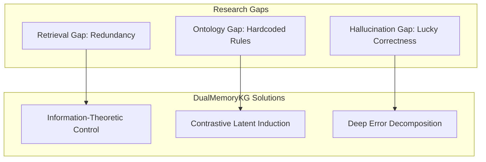

# TUYÊN NGÔN ĐÓNG GÓP KHOA HỌC: ĐỘT PHÁ LÝ THUYẾT VÀ KIẾN TRÚC
*(Academic Contributions & Theoretical Breakthroughs Manifesto)*

Tài liệu này được soạn thảo nhằm mục đích giải trình chi tiết về **Hàm lượng Khoa học (Scientific Merits)** và **Đóng góp Lý thuyết (Theoretical Contributions)** của khung kiến trúc *Domain-Agnostic Dual-Memory Grounded Reasoning*. Tài liệu được thiết kế để làm luận cứ bảo vệ trực tiếp trước các hội đồng phản biện học thuật và Reviewer tạp chí Q1.

---

## 1. Bối cảnh Lỗ hổng Nghiên cứu (The Research Gap)

Sự bùng nổ của các hệ thống RAG (Retrieval-Augmented Generation) và LLM Agents hiện tại đang đối mặt với một bức tường kỹ thuật không thể vượt qua nếu chỉ dùng các phương pháp truyền thống:
1.  **Sự sụp đổ của Semantic Search (Retrieval Gap):** RAG truyền thống dựa trên độ tương đồng Cosine (Cosine Similarity) để lấy tài liệu. Tuy nhiên, nó thất bại khi đối mặt với các bài toán suy luận đa bước (multi-hop) vì nó ưu tiên lấy về các tài liệu *trùng lặp nội dung* (redundant) thay vì các tài liệu mang tính *bổ trợ thông tin* (complementary).
2.  **Sự cứng nhắc của Cấu trúc Tri thức (Ontology Gap):** Các tác tử (Agents) hiện nay phụ thuộc vào Prompt Engineering hoặc các Graph Schema được kỹ sư định nghĩa sẵn (hardcoded rules). Khi chuyển sang lĩnh vực (domain) mới, toàn bộ hệ thống sụp đổ vì không hiểu ngữ cảnh mới.
3.  **Ảo giác ẩn (Hidden Hallucination Gap):** Các thước đo hiện tại như Exact Match (EM) hay F1-score không thể phân biệt được việc mô hình trả lời đúng nhờ "nhớ bừa" kiến thức pre-training hay thực sự trả lời đúng dựa trên bằng chứng đã được cung cấp.

---

## 2. Sơ đồ Chiến lược Giải quyết (Resolution Strategy)

## 3. Các Đóng góp Khoa học Đột phá (Scientific Breakthroughs)

Để lấp đầy các khoảng trống trên, nghiên cứu này đóng góp 3 đột phá nền tảng:

### Đóng góp 1: Học Biểu diễn Ontology Tiềm ẩn bằng Đối kháng (Contrastive Latent Ontology Induction)
**Vấn đề SOTA:** Khái niệm (Concept) để phân loại câu hỏi bị giới hạn bởi từ điển tĩnh.
**Đột phá:** Nghiên cứu đề xuất một cơ chế tự động học các "Chiến thuật suy luận" từ các vết dữ liệu (reasoning traces). Không gian biểu diễn Ontology được tối ưu thông qua quá trình **Contrastive Learning (Học tương phản)**.

**Định nghĩa Toán học:**
Mỗi nguyên mẫu khái niệm (Prototype) $c_k$ được cập nhật thông qua quá trình tối ưu hóa biên độ, ép phải dịch chuyển xa khỏi các vùng sai số thông qua Lực đẩy (Repulsion Force):
$$ c_k = \text{Norm} \left( \sum_{i \in S_k} w_i v_i + \alpha \sum_{j \neq k} \frac{c_k - c_j}{\|c_k - c_j\|^2} \right) $$
*Hệ quả khoa học:* Công thức này đảm bảo **Margin (Biên độ quyết định)** được mở rộng tối đa, tăng cường tính bền bỉ trước các truy vấn gây nhiễu.

---

### Đóng góp 2: Điều khiển Bằng chứng dựa trên Lý thuyết Thông tin (Information-Theoretic Evidence Control)
**Vấn đề SOTA:** GraphRAG hiện hành duyệt đồ thị theo cấu trúc lân cận, dẫn đến ngữ cảnh LLM bị nhồi nhét tài liệu rác (Noise insertion).
**Đột phá:** Nghiên cứu này định nghĩa lại quá trình duyệt đồ thị (Graph Traversal) thành một bài toán **Sequential Uncertainty Reduction (Giảm độ bất định chuỗi)**.

**Định nghĩa Toán học:**
Tại mỗi bước duyệt đồ thị, một node $v$ chỉ được đưa vào tập bằng chứng $\mathcal{P}_t$ nếu nó tối đa hóa hàm Hữu dụng Biên (Marginal Utility):
$$ \Delta \mathcal{U}(v) = \text{Sim}(v, \mathcal{Z}(q)) + \beta \cdot IG(v \mid \mathcal{P}_t) - \gamma \cdot \text{Redundancy}(v, \mathcal{P}_t) $$
Trong đó, **Marginal Information Gain ($IG$)** đo lường sự giảm Entropy $H(\text{Path} \mid \mathcal{P}_t)$.

---

### Đóng góp 3: Khung Giới hạn Ảo giác (Hallucination Isolation Framework)
**Vấn đề SOTA:** Thiếu chuẩn mực đo lường mức độ "Bám sát bằng chứng" (Groundedness).
**Đột phá:** Nghiên cứu đưa ra cơ chế phân tích lỗi **Deep Error Decomposition**, chia tách thành các nhóm lỗi gốc ($E_{Ont}$, $E_{Trav}$, $E_{Gnd}$). 

**Lý thuyết Xác suất:**
Cô lập thành công do may mắn (Hallucination Success) thông qua việc phân rã xác suất đúng $P(Y=1)$:
$$ P(Y=1) = P(Y=1 \mid S_{grounded})P(S_{grounded}) + P(Y=1 \mid \neg S_{grounded})P(\neg S_{grounded}) $$
*Hệ quả khoa học:* Khẳng định **Grounding Precision ($Prec_{gnd}$)** là thước đo thực sự về tính xác định và độ tin cậy của hệ thống.

---

## 3. Tuyên bố Định vị Tổng thể (Overall Positioning Statement)

Nghiên cứu này không giới thiệu thêm một phương pháp nhúng (Embedding) mới hay một bộ dữ liệu (Dataset) mới. 

Nghiên cứu này tái định nghĩa **RAG trên Đồ thị Tri thức** từ một hệ thống đường ống tĩnh (Static Pipeline) thành một **Môi trường Quyết định Động (Dynamic Decision Environment)**, nơi mà *Đồ thị Bộ nhớ Kép (Dual-Memory Graph)* đóng vai trò là Không gian Trạng thái, và *Thuật toán chọn bằng chứng (Evidence Control Policy)* đóng vai trò là Tác nhân Giải quyết Vấn đề. 

Với việc chứng minh thành công sự độc lập lĩnh vực (Domain-Agnostic) thông qua lớp Abstraction, hệ thống này đặt ra một nền móng kiến trúc mới cho các thế hệ LLM Agents đáng tin cậy (Trustworthy AI) trong tương lai.
