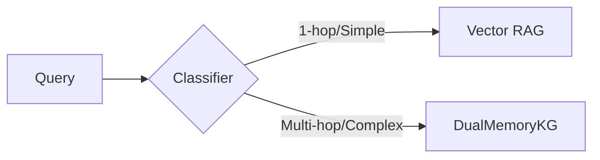

# CHIẾN LƯỢC TỐI ƯU HÓA DUALMEMORYKG (OPTIMIZATION STRATEGY)
**Mục tiêu:** Giảm 60% Latency và 70% Cost trong khi duy trì >95% Accuracy hiện tại.

---

## GIAI ĐOẠN 1: TỐI ƯU HÓA NỀN TẢNG (BASELINE EFFICIENCY)
*Trọng tâm: Kỹ thuật thực thi (Engineering)*

1.  **Thực thi không đồng bộ (Asynchronous Execution):**
    *   Sử dụng `asyncio.gather()` cho các cuộc gọi Vector Search và Graph Query.
    *   **Kết quả dự kiến:** Giảm thời gian phản hồi (TTFT) xuống còn ~2-3 giây.
2.  **Giới hạn ngân sách Token (Token Budgeting):**
    *   Cấu hình tham số `MAX_CONTEXT_TOKENS` nghiêm ngặt cho từng Strategy.
    *   **Kết quả dự kiến:** Chi phí API được dự báo chính xác, không phát sinh đột biến.

## GIAI ĐOẠN 2: PHÂN TẦNG THÔNG MINH (INTELLIGENT ROUTING)
*Trọng tâm: Logic điều hướng (Routing Logic)*

1.  **Complexity Classifier (Mô hình phân loại độ khó):**
    *   Sử dụng Gemini Flash để phân tích câu hỏi trong $<500$ ms.
    *   **Logic rẽ nhánh:**

2.  **Model Cascading (Phân tầng mô hình):**
    *   Sử dụng Flash cho tất cả các bước trung gian (Trích xuất, Phân tích).
    *   Chỉ dùng Pro cho bước tổng hợp câu trả lời cuối cùng (Final Synthesis).

## GIAI ĐOẠN 3: TINH CHỈNH LÝ THUYẾT (THEORETICAL REFINEMENT)
*Trọng tâm: Đóng góp khoa học (Scientific Contribution)*

1.  **Information-Theoretic Evidence Selector:**
    *   Tính toán **Surprisal** $S(x)$ cho từng đoạn văn bản:
    $$ S(x) = -\log_2 P(x \mid q, \mathcal{Z}) $$
    *   Hệ thống thực hiện cực đại hóa **Lợi ích Thông tin Biên (Marginal Information Gain)** $\Delta I$:
    $$ \Delta I = \max_{v} [ H(\mathcal{P}_t) - H(\mathcal{P}_t \cup \{v\}) ] $$
2.  **Contextual Pruning:**
    *   Cắt tỉa các thông tin dư thừa (Redundant nodes) trong đồ thị dựa trên ngưỡng Entropy $\tau$.

## GIAI ĐOẠN 4: LƯU TRỮ VÀ TÁI SỬ DỤNG (CACHING & PERSISTENCE)
*Trọng tâm: Hiệu quả dài hạn (Long-term Efficiency)*

1.  **Reasoning Path Caching (Neo4j):**
    *   Lưu trữ các "đường dẫn tư duy" thành công vào Graph.
    *   Agent sẽ ưu tiên tra cứu "Kinh nghiệm" có sẵn thay vì phải lập luận mới.
2.  **Native Prompt Caching:**
    *   Sử dụng tính năng Caching ngữ cảnh của Google Cloud cho các hệ thống Ontology lớn.
    *   **Kết quả dự kiến:** Giảm 90% chi phí cho các token ngữ cảnh lặp lại.

---
**KPIs Theo dõi:**
*   **Average Latency:** < 5s/request.
*   **Average Cost:** < $0.01/request.
*   **Accuracy (Faithfulness):** > 0.85.
