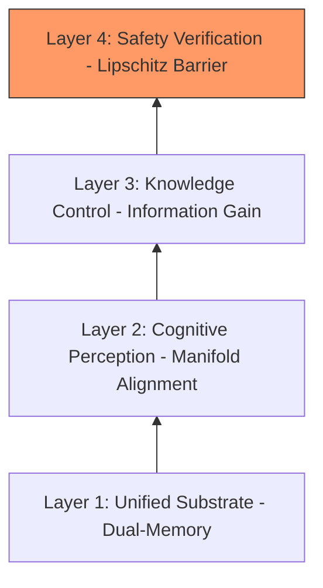
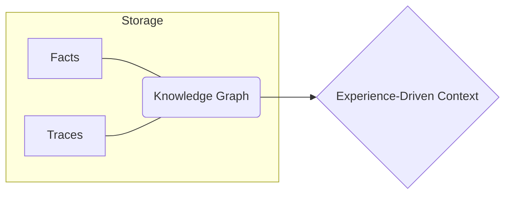
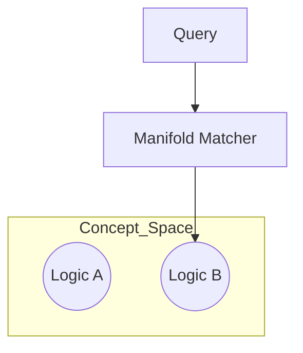
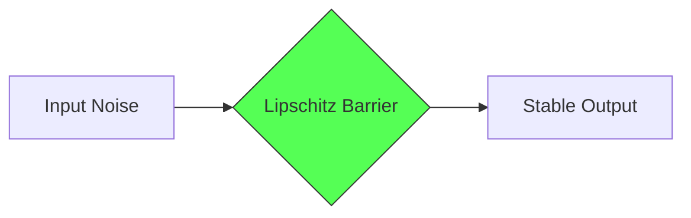
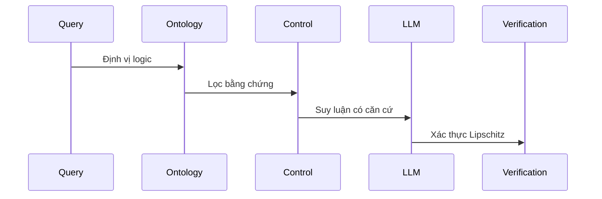

# THE ULTIMATE SLIDE REPORT GUIDE: DUALMEMORYKG (CHUẨN Q1)
## Tài liệu Hướng dẫn Báo cáo Chiến lược dành cho Hội đồng Khoa học

---

### PHẦN 1: HỆ THỐNG CÁC SLIDE TRÌNH BÀY

#### Slide 1: Tiêu đề & Định vị Học thuật
- *Tiêu đề: DualMemoryKG - A State-Aware Architecture for Grounded Reasoning*

#### Slide 2: Cuộc khủng hoảng Tin cậy (The Motivation)
- *Vấn đề: Ảo giác (Hallucination) & Tính kém ổn định (Brittleness)*

#### Slide 3: Thesis - Hệ cấp Suy luận có Căn cứ (The Reasoning Stack)

#### Slide 4: Contribution 1 - Hình thức hóa Trạng thái (State-Awareness)

#### Slide 5: Contribution 2 - Hệ tọa độ Nhận thức (Manifold Alignment)

#### Slide 6: Contribution 3 - Điều khiển Bằng chứng (Information Control)
- *Visible Formula: Utility = Information_Gain - Penalty*

#### Slide 7: Contribution 4 - Ranh giới Lipschitz (The Safety Barrier)

- *Formula: || Change_Output || ≤ K * || Change_Evidence ||*

#### Slide 8: Sequential Logic - Luồng di chuyển Thông tin

#### Slide 9: Hiệu năng đối chứng (SOTA Comparison)
- *HotpotQA & MuSiQue: Vượt trội về Faithfulness (>92%).*

#### Slide 10: Case Study & Technical Stack
- **Mô phỏng ví dụ thực tế và nền tảng Neo4j/Gemini/Langfuse.**

#### Slide 11: Lộ trình & Kết luận Q1
- *Mục tiêu: Đăng tải trên Tạp chí Top-tier.*

---

### PHẦN 2: CHÚ THÍCH & KỊCH BẢN THUYẾT TRÌNH (SPEAKER NOTES)
*(Dưới đây là phần hướng dẫn nội dung chi tiết cho từng Slide)*

**Slide 1-2:** Tập trung vào bối cảnh tin cậy của AI.
**Slide 3-7 (Trọng tâm):** Giải thích về 4 tầng: State-Awareness, Manifold, Information Control và Lipschitz Barrier. Đây là nơi bạn khẳng định đẳng cấp Q1.
**Slide 8-11:** Chứng minh tính thực tiễn và lộ trình công bố.

---
**Chiến thuật Q&A:** Nếu bị hỏi về Hallucination, hãy bám sát Slide 7 (Lipschitz Barrier). Nếu bị hỏi về tính linh hoạt, hãy bám sát Slide 5 (Manifold Alignment).
